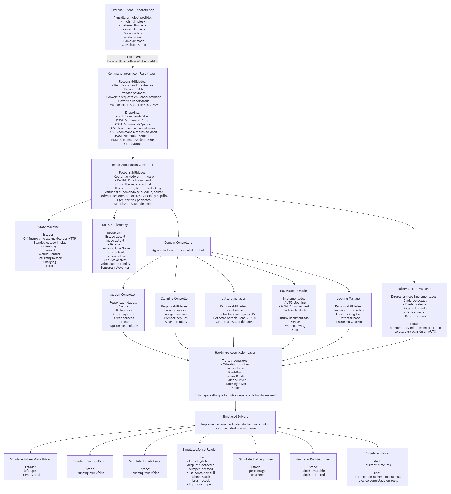

# aspiradora-arqui-2

Simulador de firmware para una aspiradora robótica doméstica, implementado en Rust. El proyecto expone una API HTTP/JSON con `axum`, modela el hardware mediante traits y usa drivers simulados en memoria para poder desarrollar y probar la lógica sin hardware físico.

## Objetivo

El foco de este repositorio es la capa de firmware:

- recibir comandos externos;
- validar requests y estado actual del robot;
- coordinar movimiento, limpieza, batería, docking y seguridad;
- exponer estado y telemetría;
- mantener una arquitectura testeable y desacoplada del hardware real.

No incluye aplicación Android, Bluetooth, GPIO real ni código específico de una placa embebida.

## Diagrama General



## Estado Actual Del Proyecto

La implementación actual ya incluye:

- API HTTP/JSON con `axum`;
- `RobotController` como orquestador principal;
- máquina de estados del robot;
- traits de HAL para desacoplar la lógica del hardware;
- drivers simulados en memoria;
- loop periódico `tick()`;
- modo `AUTO` y movimiento `MANUAL`;
- manejo de errores de seguridad;
- transición por batería baja hacia `RETURNING_TO_DOCK`;
- transición de docking a `CHARGING`;
- tests unitarios y tests HTTP de integración.

## Arquitectura

La estructura principal del crate es:

- `src/api`: rutas HTTP, modelos JSON y mapeo de errores HTTP.
- `src/application`: `RobotController`, coordinación de comandos y loop `tick()`.
- `src/domain`: comandos internos, estados, errores y modelos del robot.
- `src/controllers`: lógica funcional separada por dominio.
- `src/hal`: traits para motores, sensores, batería, docking y clock.
- `src/simulation`: drivers simulados y configuración del entorno de ejecución.
- `tests`: tests del controlador y tests HTTP contra el router de `axum`.
- `openspec`: especificaciones y cambios archivados del trabajo guiado por OpenSpec.

## Flujo De Ejecución

1. Un cliente externo envía un request HTTP/JSON.
2. La capa `api` parsea el payload y lo transforma en un `RobotCommand`.
3. `RobotController` valida el comando según el `RobotState` actual.
4. El controlador coordina los domain controllers y los drivers HAL.
5. `tick()` evalúa sensores, seguridad, batería y docking.
6. La API devuelve un `RobotStatus` o un error HTTP estructurado.

## Estado Inicial

La simulación arranca en `STANDBY` con:

- ruedas detenidas;
- succión apagada;
- cepillos apagados;
- `current_error = None`;
- `cleaning_mode = AUTO`;
- batería simulada configurable, con `80%` por defecto.

El estado `OFF` existe en el modelo, pero en esta etapa queda documentado como extensión futura y no es alcanzable por la API HTTP.

## Máquina De Estados

Estados modelados:

- `OFF`
- `STANDBY`
- `CLEANING`
- `PAUSED`
- `MANUAL_CONTROL`
- `RETURNING_TO_DOCK`
- `CHARGING`
- `ERROR`

Comportamientos relevantes implementados:

- `START` desde `STANDBY` o `PAUSED` inicia limpieza `AUTO`.
- `STOP` detiene actuadores y vuelve a `STANDBY`.
- `PAUSE` detiene actuadores y pasa a `PAUSED`.
- `RETURN_TO_DOCK` inicia retorno a base.
- batería `<= 15` durante `CLEANING` fuerza `RETURNING_TO_DOCK`.
- detección de dock durante `RETURNING_TO_DOCK` pasa a `CHARGING`.
- batería `100` durante `CHARGING` vuelve a `STANDBY`.
- condiciones críticas de seguridad pasan a `ERROR`.

## Controladores De Dominio

El firmware separa responsabilidades en controladores especializados:

- `MotionController`: avance, retroceso, giros, stop y velocidades de ruedas.
- `CleaningController`: succión, cepillos laterales y detención de limpieza.
- `BatteryManager`: lectura de batería, batería baja, carga activa y batería llena.
- `DockingManager`: disponibilidad del dock, detección de base y retorno a carga.
- `SafetyManager`: detección de condiciones críticas y parada segura de actuadores.

## HAL Y Simulación

La lógica del firmware depende de traits, no de hardware concreto. Los contratos principales están en `src/hal/traits.rs`:

- `WheelMotorDriver`
- `SuctionDriver`
- `BrushDriver`
- `SensorReader`
- `BatteryDriver`
- `DockingDriver`
- `Clock`

Las implementaciones actuales viven en `src/simulation/drivers.rs` y guardan estado en memoria.

## Comportamientos Implementados

### Limpieza y navegación

- `AUTO` inicia limpieza con ruedas, succión y cepillos activos.
- En `AUTO`, si `obstacle_detected` o `bumper_pressed` se activa, el robot ejecuta una maniobra simple de evasión sin salir de `CLEANING`.
- `MANUAL_MOVE` permite mover el robot con duración controlada por clock simulado.

### Seguridad

Las siguientes condiciones llevan al robot a `ERROR` y detienen ruedas, succión y cepillos:

- `drop_off_detected`
- `wheel_stuck`
- `brush_stuck`
- `top_cover_open`
- `dust_container_full`

### Modos de limpieza

En esta versión solo se implementan:

- `AUTO`
- `MANUAL`

Los modos `ZIGZAG`, `WALL_FOLLOWING` y `SPOT` están documentados como extensiones futuras y hoy se rechazan con `400 Bad Request` y código `UNSUPPORTED_MODE`.

## API HTTP

### Endpoints

- `POST /commands/start`
- `POST /commands/stop`
- `POST /commands/pause`
- `POST /commands/return-to-dock`
- `POST /commands/manual-move`
- `POST /commands/mode`
- `POST /commands/clear-error`
- `GET /status`

### Reglas de transporte

- `GET /status` siempre devuelve el estado actual, incluso si el robot ya está en `ERROR`.
- JSON malformado o payload inválido devuelve HTTP `400`.
- comandos válidos pero incompatibles con el estado actual devuelven HTTP `409`.
- respuestas HTTP `400` y `409` incluyen al menos `code` y `message`.

### Ejemplos

Iniciar limpieza automática:

```http
POST /commands/start
```

Mover manualmente durante 1.5 segundos:

```http
POST /commands/manual-move
Content-Type: application/json

{
  "direction": "FORWARD",
  "speed": 45,
  "duration_ms": 1500
}
```

Fijar modo de limpieza:

```http
POST /commands/mode
Content-Type: application/json

{
  "mode": "AUTO"
}
```

Consultar estado:

```http
GET /status
```

Ejemplo de `RobotStatus`:

```json
{
  "state": "STANDBY",
  "cleaning_mode": "AUTO",
  "battery_percent": 80,
  "is_charging": false,
  "suction_enabled": false,
  "brushes_enabled": false,
  "left_wheel_speed": 0,
  "right_wheel_speed": 0,
  "current_error": null,
  "sensors": {
    "obstacle_detected": false,
    "drop_off_detected": false,
    "bumper_pressed": false,
    "dust_container_full": false,
    "wheel_stuck": false,
    "brush_stuck": false,
    "top_cover_open": false
  }
}
```

Ejemplo de error estructurado:

```json
{
  "code": "COMMAND_NOT_ALLOWED",
  "message": "PAUSE_CLEANING is only allowed while actively moving",
  "current_state": "STANDBY"
}
```

## Validaciones Importantes

- `MANUAL_MOVE` requiere `direction`, `speed` y `duration_ms`.
- `duration_ms` debe ser mayor que `0`.
- `speed` debe estar en el rango `0..=100`.
- para `FORWARD`, `BACKWARD`, `LEFT` y `RIGHT`, `speed` debe ser mayor que `0`.
- para `STOP`, `speed` puede ser `0`.
- `POST /commands/start` con batería `<= 15` devuelve `409`.
- `POST /commands/start` mientras ya está limpiando devuelve `409`.
- `POST /commands/stop` desde `STANDBY` devuelve `409`.
- `POST /commands/return-to-dock` desde `STANDBY` puede iniciar retorno si el dock está disponible.
- `POST /commands/clear-error` fuera de `ERROR` devuelve `409`.

## Testing

La suite actual cubre:

- transiciones de estado principales;
- validación de comandos;
- lectura de estado por HTTP;
- errores críticos de seguridad;
- batería baja y docking;
- rechazo de modos no soportados;
- maniobras `AUTO` ante obstáculo o bumper;
- consistencia entre controladores y API HTTP.

Comandos útiles:

```bash
cargo test
cargo run
```

La aplicación levanta por defecto en:

```text
http://127.0.0.1:3000
```

## Qué Conviene Versionar

En este repositorio tiene sentido subir:

- `src/`
- `tests/`
- `Cargo.toml`
- `Cargo.lock`
- `README.md`
- `openspec/`
- `.codex/skills/` si querés conservar el flujo de trabajo del proyecto con Codex/OpenSpec

No conviene subir:

- `target/`
- `.vscode/`
- exports locales como `aspiradora-arqui2.zip`

## Limitaciones Del Alcance

Quedan explícitamente fuera de esta entrega:

- aplicación Android real;
- Bluetooth;
- GPIO real;
- código específico de una placa;
- SLAM;
- mapeo de habitaciones;
- cámara o lidar;
- algoritmos avanzados de navegación.
